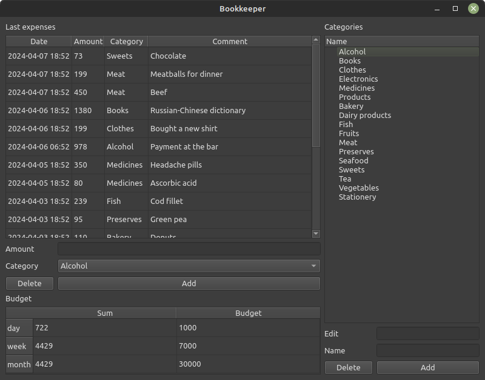

# Программа для управления личными финансами
#### (учебный проект для курса по практике программирования на Python)

[Техническое задание](specification.md)


Для работы с данными выбран подход взаимодействия с БД SQLite в соответствии с паттерном «репозиторий», с использованием библиотеки `sqlite3`. В проекте реализована архитектура Model—View—Presenter.

Вид пользовательского интерфейса приложения:



Проект создан с помощью `poetry`. Инструкцию по установке можно посмотреть [здесь](https://python-poetry.org/docs/).

Для установки всех зависимостей через `poetry` запустите следующую команду (убедитесь, что вы находитесь
в корневой папке проекта — там, где лежит файл pyproject.toml):

```commandline
poetry install
```

Для запуска приложения запустите следующую команду (убедитесь, что вы находитесь
в корневой папке проекта):
```commandline
poetry run python3 bookkeeper/gui_client.py
```

Для заполнения БД тестовыми данными запустите следующую команду (убедитесь, что вы находитесь
в корневой папке проекта):
```commandline
poetry run python3 bookkeeper/fill_db.py
```

Для запуска тестов и статических анализаторов используйте следующие команды (убедитесь, 
что вы находитесь в корневой папке проекта):
```commandline
poetry run pytest --cov
poetry run mypy --strict bookkeeper
poetry run pylint bookkeeper
poetry run flake8 bookkeeper
```

Cтруктура файлов и каталогов (модулей и пакетов) проекта:

📁 bookkeeper — исполняемый код 

- 📁 models — модели данных

    - 📄 budget.py — бюджет
    - 📄 category.py — категория расходов
    - 📄 expense.py — расходная операция
- 📁 presenters — логика взаимодействия репозиториев с UI

    - 📄 budget.py — бюджет
    - 📄 category.py — категория расходов
    - 📄 expense.py — расходная операция
- 📁 repository — репозиторий для хранения данных

    - 📄 abstract_repository.py — описание интерфейса
    - 📄 memory_repository.py — репозиторий для хранения в оперативной памяти
    - 📄 sqlite_repository.py — репозиторий для хранения в sqlite (пока не написан)
- 📁 view — графический интерфейс

    - 📄 abstract_budget_view.py — абстрактный интерфейс бюджета
    - 📄 abstract_category_view.py — абстрактный интерфейс категории расходов
    - 📄 abstract_expense_view.py — абстрактный интерфейс расходной операции
    - 📄 budget_view.py — реализация интерфейса бюджета
    - 📄 category_view.py — реализация интерфейса категории расходов
    - 📄 expense_view.py — реализация интерфейса расходной операции
- 📄 fill_db.py — скрипт для заполнения базы демонстрационными данными
- 📄 gui_client.py — главный скрипт для запуска графического интерфейса приложения
- 📄 simple_client.py — простая консольная утилита, позволяющая посмотреть на работу программы в действии
- 📄 utils.py — вспомогательные функции

📁 tests — тесты (структура каталога дублирует структуру bookkeeper)
